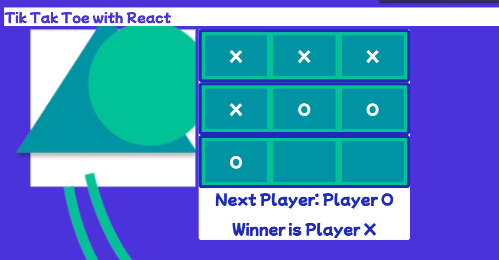

# ticTacToeReact
# 

## Table of contents
* [General info](#general-info)
* [Skills](#skills)
* [Setup](#setup)
* [Roadmap of Future Improvements](#Roadmapoffutureimprovements)
* [License](#license)
## General info
This game was built using React and consists of a parent Board component with each square and each player as children. The board keeps track of which player goes next, the overall score, and which tik is on what square.
	
## Skills
This exercise uses:
* HTML
* JavaScript
* React
* CSS

	
## Setup
To run this exercise, simply clone this respository. In your terminal you will want make sure repo is your current directory and then open a local server. 
$ http-server -c-1 and click on the folder.

To see the deployed version click <a href="https://tictactoereact.s3.amazonaws.com/standalone.html">HERE</a>.

## Roadmap for Future Improvements
* Create different styling templates for the user to choose from at the start of the game. This can be implemented by creating a button with onClick event that can toggle various css styles.
* Keep track of scores for each round played. This can be done by keeping state with each player's round score that is intialized with 0 that increments with a win for that player.

## License
MIT License

Copyright (c) 2020 John Williams

Permission is hereby granted, free of charge, to any person obtaining a copy
of this software and associated documentation files (the "Software"), to deal
in the Software without restriction, including without limitation the rights
to use, copy, modify, merge, publish, distribute, sublicense, and/or sell
copies of the Software, and to permit persons to whom the Software is
furnished to do so, subject to the following conditions:

The above copyright notice and this permission notice shall be included in all
copies or substantial portions of the Software.

THE SOFTWARE IS PROVIDED "AS IS", WITHOUT WARRANTY OF ANY KIND, EXPRESS OR
IMPLIED, INCLUDING BUT NOT LIMITED TO THE WARRANTIES OF MERCHANTABILITY,
FITNESS FOR A PARTICULAR PURPOSE AND NONINFRINGEMENT. IN NO EVENT SHALL THE
AUTHORS OR COPYRIGHT HOLDERS BE LIABLE FOR ANY CLAIM, DAMAGES OR OTHER
LIABILITY, WHETHER IN AN ACTION OF CONTRACT, TORT OR OTHERWISE, ARISING FROM,
OUT OF OR IN CONNECTION WITH THE SOFTWARE OR THE USE OR OTHER DEALINGS IN THE
SOFTWARE.
